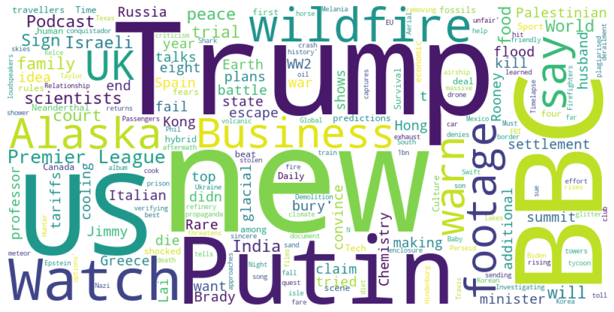
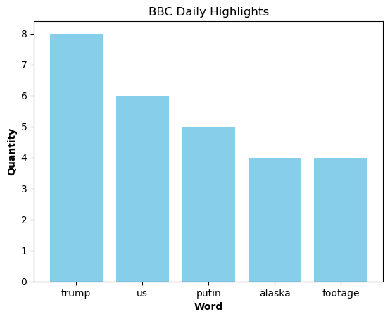

## Projeto para extrair os destaques de notícias do veículo de mídia BBC
* Utilizando o **BeutifulSoup** pude aplicar a técnica de **webscrapping** para extrair informações das headlines do dia.
* Tendo as informações tratadas, utilizei o **WorldCloud** para extrair e plotar em palavras-chave o destaques atualizados.
* Com isso podemos ter acesso a informações de forma veloz toda vez que rodarmos o script.  


```python
import requests
import pandas as pd
from bs4 import BeautifulSoup
```


```python
url = 'https://www.bbc.com/'
page = requests.get(url)
soup = BeautifulSoup(page.text, 'html')
```


```python
headline = soup.find_all('h2')  #após inpecionar o portal, a tag <h2> é a que desejamos para coletar as headlines 
text = ''
for i in headline: #utilizando um laço para extrair e concatenar todas as headlines
    text+=" "+i.text+" "
```


```python
print(text) #verificando o conteúdo das headlines que foi extraído e concatenado
```

     What do Putin and Trump each want from summit in Alaska?  Israeli settlement plans will 'bury' idea of Palestinian state, minister says  What do Putin and Trump each want from summit in Alaska?  Israeli settlement plans will 'bury' idea of Palestinian state, minister says  Putin says US making sincere effort on Ukraine peace as Trump to 'exhaust all options' to end war  Relationship and new album - what we learned from Taylor Swift on Travis Kelce's podcast  Investigating fire at Russia oil refinery and verifying India flood footage  Watch: Passengers escape car hit by drone in Russia  FBI returns stolen conquistador document to Mexico  Only from the BBC  16 of the best films of the year so far  The Italian isle where you cook in volcanic sand  Global News Podcast  More news  EU sending wildfire help to Spain as death toll rises  US warns of additional tariffs on India if Trump-Putin peace talks fail  Chemistry on trial: How a professor tried to convince a court she didn’t kill her husband  N Korea denies removing propaganda loudspeakers at border  Melania Trump threatens to sue Hunter Biden for $1bn over Epstein claim  US warns of additional tariffs on India if Trump-Putin peace talks fail  Jimmy Lai could die in prison, Hong Kong tycoon's son tells BBC  Baby Shark song not plagiarised - South Korean top court  Chemistry on trial: How a professor tried to convince a court she didn’t kill her husband  Must watch  Rare footage of the WW2 Nazi Hindenburg airship crash  'It was very unfair' - Rooney on Brady criticism  Night skies glitter with Perseid meteor shower  Firefighters battle wildfires in Spain   Demolition 'history' as eight cooling towers fall  Timelapse captures rising glacial lakes in Alaska  Wildfire approaches horse enclosure in Greece  Aerial footage shows aftermath of massive train derailment in Texas  Earth  My quest for a climate-friendly family diet  Premier League  How will your club fare? Phil McNulty's Premier League predictions  US & Canada news  Air Canada to begin cancelling flights ahead of potential strike  National Guard troops appear in Washington DC as mayor rejects Trump's 'authoritarian push'  Family among four killed in Tennessee floods  Canadian province faces pushback after banning entry to woods over wildfire fears  More world news  BBC defends investigation of Kenya child-sex trafficking after 'hoax' claims  'Our children are dying': Rare footage shows plight of civilians in besieged Sudan city  New Israeli rules stopping critical aid getting into Gaza, charities say  Rain warning delays landmark trial of Hong Kong's rebel mogul Jimmy Lai  Sport  Brady questioning my work ethic was very unfair - Rooney  Premier League predictions 2025-26: BBC Sport pundits pick their top four  Premier League news conferences: Wissa to miss Brentford opener amid transfer speculation  Slot reveals Leoni deal but no comment on Guehi  Business   UK economic growth slows but beats forecasts  Australia and Vanuatu agree to $328m security and business deal   Economic woes dominate as Bolivia prepares to go to the polls  Firm apologises for saying it would not process LGBTQ+ payments  Latest audio  Business Daily  In Our Time  Witness History  F1: Chequered Flag  The Documentary Podcast  Football Daily  The Food Chain  World Business Report  Tech  England expands police use of facial recognition vans  FM26 drops first look after months of silence  Porn site traffic plummets as UK age verification rules enforced  How language is hiding the real internet from you  Science & health  ADHD drugs have wider life benefits, study suggests  UK cases of mosquito-borne virus more than double  The hybrid human-Neanderthal fossils that shocked scientists  Survival rates for most deadly cancers making little progress, experts warn  Culture  Second MasterChef contestant edited out of new series  'One take wonder': David Jason on that  iconic chandelier scene  The radical manifesto hidden in a masterpiece  Sylvester Stallone among Kennedy Center honourees announced by Trump  Arts   Miriam Margolyes: 'We'll all die, but I'm not going yet'  Robert Burns family flute restored and played again after 150 years  The curious story of Britain's most famous WW2 poster  Why the Statue of Liberty is at the heart of a culture war  Watch  The hybrid human-Neanderthal fossils that shocked scientists  Travel  Should we be visiting places that are vanishing?  Argentina's wild new coastal escape  The end of 'perfect timing' for travellers  The US town built by and for Chinese people  World's Table  Costa Rica's nine-course meal in the sky  What is 'real' Italian pizza?  The 'other' Michelin award travellers should know  Eight cooling foods to beat the heat in Japan  Earth  Hot, dry summers bring new 'firewave' risk to UK cities, scientists warn  Biosecurity alert after Asian hornet captured in Cork  Greece battles wildfires as heatwave rages across southern Europe  Evacuations in Alaska after glacial melt raises fears of record flooding  Video  Watch Spinosaurus' fierce fight for food and survival  Watch kitten try to catch fish for the first time  Behind the scenes at Gaudi's stunning La Sagrada Familia  Do you need to drink electrolytes to stay hydrated?  Discover more from the BBC  Sign up to Tech Decoded  Download the BBC app  US Politics Unspun  Register for a BBC account  Sign up for the Essential List  Sign up to News Briefing 
    


```python
# Importando as bibliotecas para nuvem de palavras
from wordcloud import WordCloud
import matplotlib.pyplot as plt

# Criando um objeto a partir do texto concatenado que foi retirado do veículo BBC
wordcloud = WordCloud(width=800, height=400, background_color='white').generate(text)

# Preparando a plotagem
plt.figure(figsize=(10, 5))
plt.imshow(wordcloud)
# Escondendo os eixos
plt.axis('off')
plt.tight_layout(pad=0)
plt.show()
```


    

    


## Acessando os dados brutos, tratando e plotando em um gráfico
* Utilizando **STOPWORDS** para organizar os dados brutos em um **dicionário**.
* Fazendo a **limpeza e tratamento dos dados** para **ordem decrescente** para extrair o top 5.
* Plotando em um gráfico de barras utilizando o **matplot**.  


```python
from wordcloud import WordCloud, STOPWORDS
from collections import Counter
import re

# Processando o texto
words = re.findall(r'\b\w+\b', text.lower()) # Normalizando as keys.
filtered_words = [word for word in words if word not in STOPWORDS] # Removendo os espaços

# Calculando a frequência das palavras
word_counts = Counter(filtered_words)

# Verificando as palavras
print(word_counts)


```

    Counter({'s': 10, 'trump': 8, 'bbc': 7, 'us': 6, 'news': 6, 'putin': 5, 'new': 5, 'watch': 5, 'alaska': 4, 'footage': 4, 'premier': 4, 'league': 4, 'business': 4, 'uk': 4, 'israeli': 3, 'will': 3, 'says': 3, 'peace': 3, 'podcast': 3, 'india': 3, 'wildfire': 3, 'trial': 3, 'court': 3, 'family': 3, 'world': 3, 'scientists': 3, 'sign': 3, 'want': 2, 'summit': 2, 'settlement': 2, 'plans': 2, 'bury': 2, 'idea': 2, 'palestinian': 2, 'state': 2, 'minister': 2, 'making': 2, 'end': 2, 'war': 2, 'russia': 2, 'escape': 2, 'italian': 2, 'spain': 2, 'warns': 2, 'additional': 2, 'tariffs': 2, 'talks': 2, 'fail': 2, 'chemistry': 2, 'professor': 2, 'tried': 2, 'convince': 2, 'didn': 2, 't': 2, 'kill': 2, 'husband': 2, 'jimmy': 2, 'lai': 2, 'die': 2, 'hong': 2, 'kong': 2, 'top': 2, 'rare': 2, 'ww2': 2, 'unfair': 2, 'rooney': 2, 'brady': 2, 'wildfires': 2, 'history': 2, 'eight': 2, 'cooling': 2, 'glacial': 2, 'greece': 2, 'shows': 2, 'earth': 2, 'predictions': 2, 'canada': 2, 'among': 2, 'four': 2, 'fears': 2, 'rules': 2, 'sport': 2, 'deal': 2, 'economic': 2, 'daily': 2, 'time': 2, 'food': 2, 'tech': 2, 'first': 2, 'real': 2, 'hybrid': 2, 'human': 2, 'neanderthal': 2, 'fossils': 2, 'shocked': 2, 'survival': 2, 'warn': 2, 'culture': 2, 'travellers': 2, 'sincere': 1, 'effort': 1, 'ukraine': 1, 'exhaust': 1, 'options': 1, 'relationship': 1, 'album': 1, 'learned': 1, 'taylor': 1, 'swift': 1, 'travis': 1, 'kelce': 1, 'investigating': 1, 'fire': 1, 'oil': 1, 'refinery': 1, 'verifying': 1, 'flood': 1, 'passengers': 1, 'car': 1, 'hit': 1, 'drone': 1, 'fbi': 1, 'returns': 1, 'stolen': 1, 'conquistador': 1, 'document': 1, 'mexico': 1, '16': 1, 'best': 1, 'films': 1, 'year': 1, 'far': 1, 'isle': 1, 'cook': 1, 'volcanic': 1, 'sand': 1, 'global': 1, 'eu': 1, 'sending': 1, 'help': 1, 'death': 1, 'toll': 1, 'rises': 1, 'n': 1, 'korea': 1, 'denies': 1, 'removing': 1, 'propaganda': 1, 'loudspeakers': 1, 'border': 1, 'melania': 1, 'threatens': 1, 'sue': 1, 'hunter': 1, 'biden': 1, '1bn': 1, 'epstein': 1, 'claim': 1, 'prison': 1, 'tycoon': 1, 'son': 1, 'tells': 1, 'baby': 1, 'shark': 1, 'song': 1, 'plagiarised': 1, 'south': 1, 'korean': 1, 'must': 1, 'nazi': 1, 'hindenburg': 1, 'airship': 1, 'crash': 1, 'criticism': 1, 'night': 1, 'skies': 1, 'glitter': 1, 'perseid': 1, 'meteor': 1, 'shower': 1, 'firefighters': 1, 'battle': 1, 'demolition': 1, 'towers': 1, 'fall': 1, 'timelapse': 1, 'captures': 1, 'rising': 1, 'lakes': 1, 'approaches': 1, 'horse': 1, 'enclosure': 1, 'aerial': 1, 'aftermath': 1, 'massive': 1, 'train': 1, 'derailment': 1, 'texas': 1, 'quest': 1, 'climate': 1, 'friendly': 1, 'diet': 1, 'club': 1, 'fare': 1, 'phil': 1, 'mcnulty': 1, 'air': 1, 'begin': 1, 'cancelling': 1, 'flights': 1, 'ahead': 1, 'potential': 1, 'strike': 1, 'national': 1, 'guard': 1, 'troops': 1, 'appear': 1, 'washington': 1, 'dc': 1, 'mayor': 1, 'rejects': 1, 'authoritarian': 1, 'push': 1, 'killed': 1, 'tennessee': 1, 'floods': 1, 'canadian': 1, 'province': 1, 'faces': 1, 'pushback': 1, 'banning': 1, 'entry': 1, 'woods': 1, 'defends': 1, 'investigation': 1, 'kenya': 1, 'child': 1, 'sex': 1, 'trafficking': 1, 'hoax': 1, 'claims': 1, 'children': 1, 'dying': 1, 'plight': 1, 'civilians': 1, 'besieged': 1, 'sudan': 1, 'city': 1, 'stopping': 1, 'critical': 1, 'aid': 1, 'getting': 1, 'gaza': 1, 'charities': 1, 'say': 1, 'rain': 1, 'warning': 1, 'delays': 1, 'landmark': 1, 'rebel': 1, 'mogul': 1, 'questioning': 1, 'work': 1, 'ethic': 1, '2025': 1, '26': 1, 'pundits': 1, 'pick': 1, 'conferences': 1, 'wissa': 1, 'miss': 1, 'brentford': 1, 'opener': 1, 'amid': 1, 'transfer': 1, 'speculation': 1, 'slot': 1, 'reveals': 1, 'leoni': 1, 'comment': 1, 'guehi': 1, 'growth': 1, 'slows': 1, 'beats': 1, 'forecasts': 1, 'australia': 1, 'vanuatu': 1, 'agree': 1, '328m': 1, 'security': 1, 'woes': 1, 'dominate': 1, 'bolivia': 1, 'prepares': 1, 'go': 1, 'polls': 1, 'firm': 1, 'apologises': 1, 'saying': 1, 'process': 1, 'lgbtq': 1, 'payments': 1, 'latest': 1, 'audio': 1, 'witness': 1, 'f1': 1, 'chequered': 1, 'flag': 1, 'documentary': 1, 'football': 1, 'chain': 1, 'report': 1, 'england': 1, 'expands': 1, 'police': 1, 'use': 1, 'facial': 1, 'recognition': 1, 'vans': 1, 'fm26': 1, 'drops': 1, 'look': 1, 'months': 1, 'silence': 1, 'porn': 1, 'site': 1, 'traffic': 1, 'plummets': 1, 'age': 1, 'verification': 1, 'enforced': 1, 'language': 1, 'hiding': 1, 'internet': 1, 'science': 1, 'health': 1, 'adhd': 1, 'drugs': 1, 'wider': 1, 'life': 1, 'benefits': 1, 'study': 1, 'suggests': 1, 'cases': 1, 'mosquito': 1, 'borne': 1, 'virus': 1, 'double': 1, 'rates': 1, 'deadly': 1, 'cancers': 1, 'little': 1, 'progress': 1, 'experts': 1, 'second': 1, 'masterchef': 1, 'contestant': 1, 'edited': 1, 'series': 1, 'one': 1, 'take': 1, 'wonder': 1, 'david': 1, 'jason': 1, 'iconic': 1, 'chandelier': 1, 'scene': 1, 'radical': 1, 'manifesto': 1, 'hidden': 1, 'masterpiece': 1, 'sylvester': 1, 'stallone': 1, 'kennedy': 1, 'center': 1, 'honourees': 1, 'announced': 1, 'arts': 1, 'miriam': 1, 'margolyes': 1, 'll': 1, 'm': 1, 'going': 1, 'yet': 1, 'robert': 1, 'burns': 1, 'flute': 1, 'restored': 1, 'played': 1, '150': 1, 'years': 1, 'curious': 1, 'story': 1, 'britain': 1, 'famous': 1, 'poster': 1, 'statue': 1, 'liberty': 1, 'heart': 1, 'travel': 1, 'visiting': 1, 'places': 1, 'vanishing': 1, 'argentina': 1, 'wild': 1, 'coastal': 1, 'perfect': 1, 'timing': 1, 'town': 1, 'built': 1, 'chinese': 1, 'people': 1, 'table': 1, 'costa': 1, 'rica': 1, 'nine': 1, 'course': 1, 'meal': 1, 'sky': 1, 'pizza': 1, 'michelin': 1, 'award': 1, 'know': 1, 'foods': 1, 'beat': 1, 'heat': 1, 'japan': 1, 'hot': 1, 'dry': 1, 'summers': 1, 'bring': 1, 'firewave': 1, 'risk': 1, 'cities': 1, 'biosecurity': 1, 'alert': 1, 'asian': 1, 'hornet': 1, 'captured': 1, 'cork': 1, 'battles': 1, 'heatwave': 1, 'rages': 1, 'across': 1, 'southern': 1, 'europe': 1, 'evacuations': 1, 'melt': 1, 'raises': 1, 'record': 1, 'flooding': 1, 'video': 1, 'spinosaurus': 1, 'fierce': 1, 'fight': 1, 'kitten': 1, 'try': 1, 'catch': 1, 'fish': 1, 'behind': 1, 'scenes': 1, 'gaudi': 1, 'stunning': 1, 'la': 1, 'sagrada': 1, 'familia': 1, 'need': 1, 'drink': 1, 'electrolytes': 1, 'stay': 1, 'hydrated': 1, 'discover': 1, 'decoded': 1, 'download': 1, 'app': 1, 'politics': 1, 'unspun': 1, 'register': 1, 'account': 1, 'essential': 1, 'list': 1, 'briefing': 1})
    


```python
del word_counts['s'],word_counts['bbc'],word_counts['news'],word_counts['new'],word_counts['watch']  #Limpando os termos desnecessários do dicionário
```


```python
# 2. Definindo as chaves e os valores
word = list(sorted_by_value.keys())
quantities = list(sorted_by_value.values())

# 3. Plotando em um gráfico de barra e limitando o array para os 5 termos mais frequentes. 
plt.bar(word[0:5], quantities[0:5], color='skyblue')

# 4. Inserindo os labels e título do gráfico
plt.xlabel('Word', fontweight='bold')
plt.ylabel('Quantity', fontweight='bold')
plt.title('BBC Daily Highlights')

# 5. Plotando o gráfico
plt.show()
```


    

    

